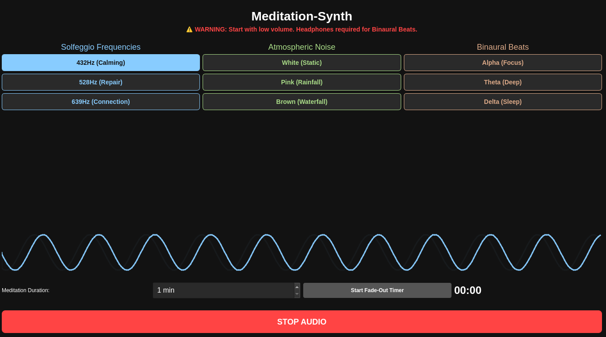
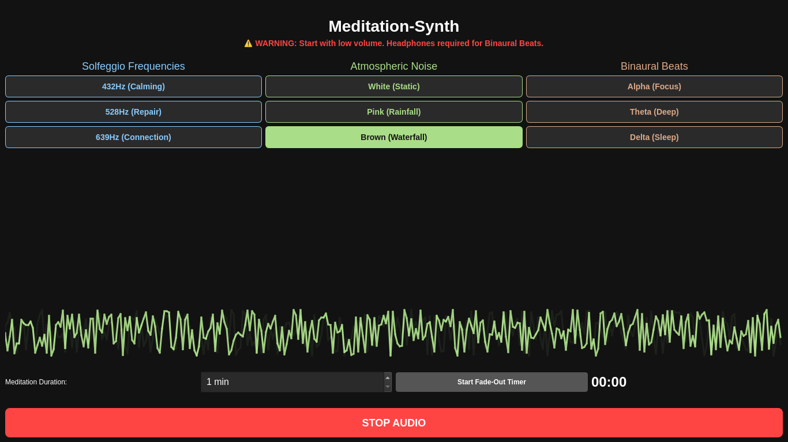
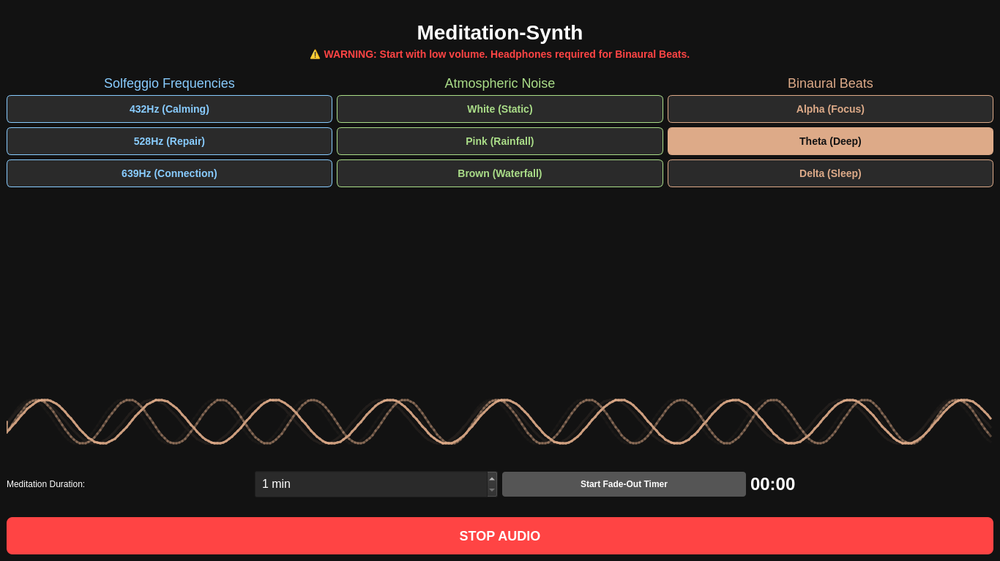

# Meditation-Synth
***What even is this application***
Meditaion-Synth is a Python desktop application that generates custom frequencies, binaural beats, and atmospheric noise to help you focus, relax, or meditate.Whether you are deep in a coding session, writing, studying, or just trying to clear your head, these sounds are designed to tune out distractions.There are no downloaded MP3s or internet audio files for these frequencies or other sounds.All frequencies, binaural beats and atmospheric noise is sythesized in real-time using Mathematics and Python.

***Built With***
**Python**: Core logic and application structure.
**NumPy**: Mathematics to generate sounds to make my audio_engine.
**Pygame (pygame-ce)**: Audio buffer playback and multi-channel mixing.
**PyQt6**: Runs the graphical user interface, event timers, and animation.

***Images***

***How to Contribute***
TO contribute all you have to do is simply use the app!
**Test and Report**: Find bugs, glitches or something that can be improved.
**Suggest Ideas**: Ideas for a new frequency you like, a different background noise or UI tweak anything that you wish.
**Mod** You are free to take this code, customize it to your liking and build better tools/apps on top of this.

***Deployment***

You don't need Python or any external libraries installed to run this app. It has been packaged as a standalone Linux executable.

1. Go to the **Releases** tab on the right side of this GitHub page.
2. Download the `Meditation-Synth-Linux.zip` file.
3. Extract the zip file anywhere on your computer.
4. Open the extracted folder and double-click the `main` executable to start the app.

*Note: Depending on your Linux distribution, you might need to right-click the `main` file, go to Properties > Permissions, and check "Allow executing file as program" before it will open.*